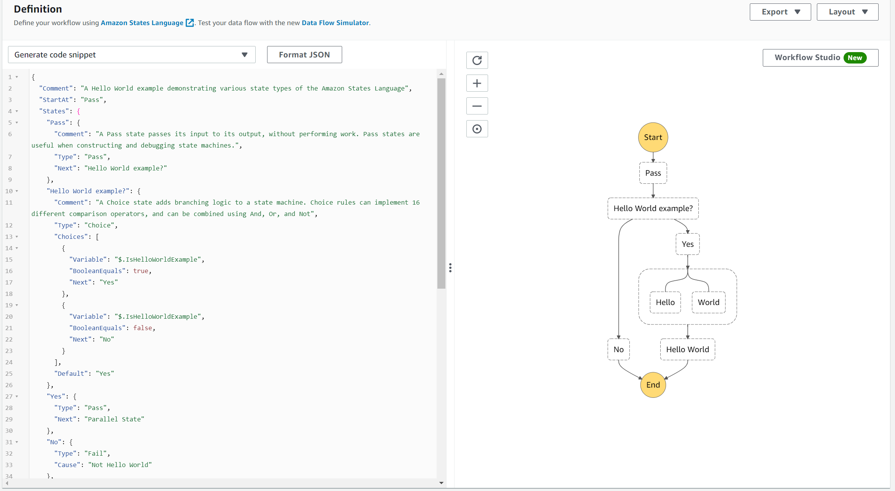
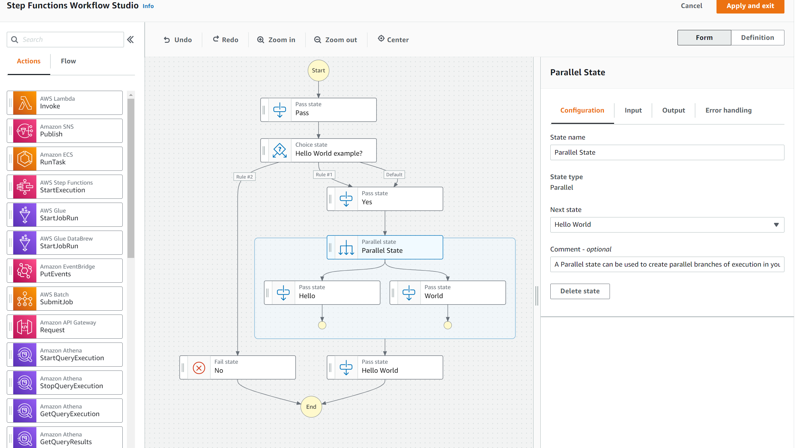
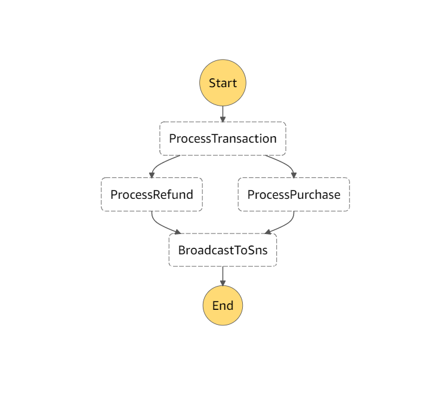

# lets learn about AWS step functions 

## Intro: what are AWS Stepfunctions? 

> a visual workflow builder used to orchestrate AWS services, automate processes, and build serverless applications.  Create standardized processes around handling failures, retries, and parallelization to free developer teams for higher-value business logic. -   https://aws.amazon.com/step-functions

AWS step functions allows you to create a State Machine, a series of steps or 'states', each perform some actions and retain information from step 'state' to step. 

- Lambda functions are stateless
  this makes more complicated or multi part operations difficult to orchestrate in lambda

### some use cases for step functions

- **ETL tool** - multiple ETL steps can be run linearly or in parallel
  why would you use step functions vs traditionally tools?
  decoupling compute form workflow
  
- **Data science and machine learning** data science and machine learning projects often have multiple data updating and processing steps that must be run to update and publish a model
  example:
  
  1. Collect data 
  
  2. prepare data:
     1. handle nulls ie input 
     
     2. one hot encode categoricals 
    
  3. integer encode ordinal values 
  
  4. model train/publish 
  
       **Etc**
       Aws step function SDK for data science - https://github.com/aws/aws-step-functions-data-science-sdk-python
  
- yelps use case - https://engineeringblog.yelp.com/2017/11/breaking-down-the-monolith-with-aws-step-functions.html 

## how to create our state functions

**traditionally** -  [Amazon states language](https://states-language.net/spec.html) 

**new this month** - Workflow studio GUI

## Create a Demo step function:

we will now create a demo step function that will call one of two lambda functions based on input and send a email reporting which function was run steps:

1. outline state machine
2. create lambda functions
3. create AMI to allow state-machine to run lambda functions
4. create state machine
5. test state machine

## Discussion

* what are some other use cases for step functions 

## Credits 

Most of the code was modified from examples Demo on the [Be a better Dev](https://www.youtube.com/channel/UCraiFqWi0qSIxXxXN4IHFBQ) Youtube channel 